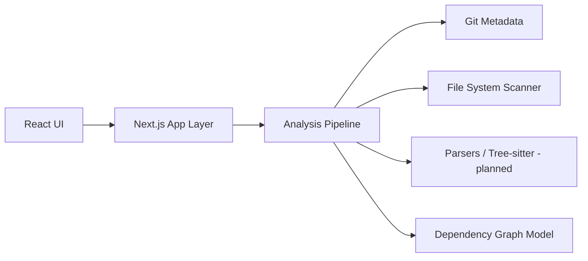

# Cartographer

Cartographer is a local-first, read-only repository intelligence dashboard. It inspects local software repositories from a server-side Node.js boundary and presents practical engineering information about files, languages, Git history, metadata, and TODO/FIXME-style markers.

This is an early v0 foundation. It favors accurate, transparent repository facts over decorative file browsing, and it intentionally avoids modifying the repositories it analyzes.

## Goals

- Help developers understand unfamiliar repositories from local source data.
- Demonstrate TypeScript application architecture across UI, server-side analysis, and parsing boundaries.
- Start with practical repository, package/module, file, and import/dependency analysis.
- Avoid promising broad control-flow analysis before the analysis model supports it.

## Current v0 Capabilities

- Analyze a local repository path through a Next.js App Router UI.
- Validate absolute and relative repository paths with typed errors.
- Recursively scan files while ignoring common dependency, build, cache, IDE, and Git directories.
- Detect text vs binary files with a practical heuristic.
- Count files, source files, bytes, approximate text/source lines, and largest files.
- Detect common languages from extensions and well-known filenames.
- Read Git status and history with the local Git CLI when available.
- Detect README, manifests, Docker files, CI, tests, environment examples, and licenses.
- Count TODO, FIXME, HACK, and XXX markers in recognized source files.
- Preserve scan results as structured TypeScript data.

## Planned Features

- Add or select local repositories.
- Repository metadata display.
- File-tree visualization.
- Language statistics.
- Dependency analysis.
- Import and module graph.
- Git history and contributor information.
- Commit activity and file churn.
- Code hotspot discovery.
- TODO/FIXME discovery.
- Test, CI, Docker, deployment-file, and entrypoint discovery.
- Interactive graph visualization.
- Future deeper language-specific static analysis.

## Architecture

The architecture separates UI features from local repository analysis. React components do not perform filesystem or Git operations directly. The App Router UI calls a server action, which calls the server-side analyzer:

```ts
analyzeRepository(path: string): Promise<RepositoryAnalysis>
```

Server-side modules inspect Git repositories, scan files, collect facts, and provide structured data to React views. Initial analysis moves from repository validation to filesystem scanning, language summaries, Git summaries, metadata detection, and marker detection.



## Repository Structure

- `src/app` - Next.js app routes, shell, and server actions.
- `src/components` - shared UI components.
- `src/features/repositories` - repository selection and metadata feature.
- `src/features/explorer` - file-tree and repository explorer feature.
- `src/features/languages` - language statistics feature.
- `src/features/git` - Git activity and contributor views.
- `src/features/dependencies` - dependency and import analysis views.
- `src/features/graphs` - graph visualization views.
- `src/server/analysis` - repository analysis orchestration and scanning.
- `src/server/git` - Git CLI integration.
- `src/server/parsers` - planned source parsing boundaries.
- `src/server/repositories` - planned repository registry and access code.
- `docs` - architecture and analysis pipeline notes.

## Technology Stack

- TypeScript - primary language.
- React - planned UI library.
- Next.js - planned application framework.
- Node.js - planned runtime for local repository analysis.
- Git CLI - repository metadata source.
- Tree-sitter - planned source parsing where useful.
- Graph visualization library - planned later.
- PostgreSQL - planned only if persistence becomes necessary.

## Development

Prerequisites:

- Node.js compatible with the installed Next.js version.
- npm.
- Git on `PATH` for Git intelligence. Filesystem analysis still works when Git is unavailable.

Install dependencies:

```bash
npm install
```

Start the development server:

```bash
npm run dev
```

Then open the local Next.js URL and enter a repository path. Absolute and relative paths are supported. Relative paths are resolved from the Cartographer process working directory.

Useful verification commands:

```bash
npm run typecheck
npm run lint
npm test
npm run build
```

## Read-Only Guarantee

Cartographer is read-only with respect to analyzed repositories. It does not write files, install dependencies, format code, check out branches, alter Git state, or otherwise mutate the repository being inspected. It only reads filesystem metadata, text content within size safeguards, and Git CLI output.

The test suite creates and removes temporary fixture repositories under the operating system temp directory.

## Current Limitations

- Language detection is extension- and filename-based only.
- Line counts are approximate and skip very large text files.
- Manifest files are detected but not deeply parsed.
- Dependency graphs, Tree-sitter parsing, complexity metrics, graph visualization, persistence, and historical snapshots are not implemented yet.
- Git history depends on the local Git CLI and the repository's available history.

## Roadmap

- [ ] Define repository analysis data model.
- [ ] Build local repository selection and metadata extraction.
- [ ] Add file-tree and language statistics analysis.
- [ ] Add import and dependency extraction for initial languages.
- [ ] Add Git history and churn summaries.
- [ ] Add TODO/FIXME, test, CI, and deployment-file discovery.
- [ ] Add graph visualization for module relationships.
- [ ] Decide whether persistence is justified.

## License

MIT. See `LICENSE`.

Cartographer is under active development.
