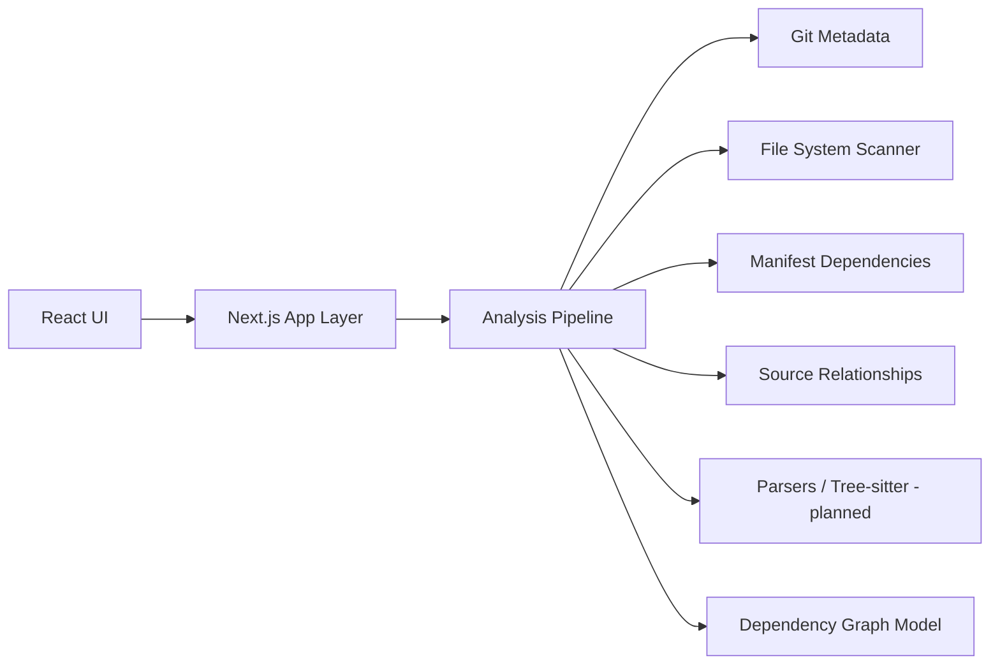

# Cartographer

Cartographer is a local-first, read-only repository intelligence dashboard. It inspects local software repositories from a server-side Node.js boundary and presents practical engineering information about files, languages, Git history, metadata, and TODO/FIXME-style markers.

This is an early v0 foundation. It favors accurate, transparent repository facts over decorative file browsing, and it intentionally avoids modifying the repositories it analyzes.

## Goals

- Help developers understand unfamiliar repositories from local source data.
- Demonstrate TypeScript application architecture across UI, server-side analysis, and parsing boundaries.
- Start with practical repository, package/module, file, and import/dependency analysis.
- Avoid promising broad control-flow analysis before the analysis model supports it.

## Current v0 Capabilities

- Analyze a local repository path through a Next.js App Router UI.
- Save frequently analyzed local repository paths as projects for quick reopening.
- Validate absolute and relative repository paths with typed errors.
- Recursively scan files while ignoring common dependency, build, cache, IDE, and Git directories.
- Detect text vs binary files with a practical heuristic.
- Count files, source files, bytes, approximate text/source lines, and largest files.
- Detect common languages from extensions and well-known filenames.
- Read Git status and history with the local Git CLI when available.
- Detect README, manifests, Docker files, CI, tests, environment examples, and licenses.
- Analyze declared project manifests for Node.js, Rust, Go, and Python dependencies.
- Analyze source-level module/import relationships for TypeScript, JavaScript, Rust, Go, and Python.
- Count TODO, FIXME, HACK, and XXX markers in recognized source files.
- Preserve scan results as structured TypeScript data.

## Saved Projects

Cartographer can save local repository paths as projects. A saved project stores only:

- a stable project id
- repository path
- display name
- created timestamp
- last opened timestamp

Saved projects are stored in a local SQLite database at:

```text
data/cartographer.db
```

The `data/` directory is ignored by Git. Saved projects are references to repositories, not analysis snapshots. When you open a saved project, Cartographer analyzes the repository fresh using the current files and Git history.

If a saved path is moved or deleted, Cartographer keeps the saved entry, marks it as unavailable, and lets you remove it manually.

## Dependency Intelligence

Cartographer analyzes dependency data from declared manifests only. It does not install packages, run package managers, contact registries, or resolve transitive dependency graphs.

Supported manifest formats:

- Node.js: `package.json`
- Rust: `Cargo.toml`
- Go: `go.mod`
- Python: `pyproject.toml`, `requirements.txt`

Current dependency intelligence includes:

- multiple detected projects in one repository
- direct dependency counts grouped by ecosystem and category
- Node scripts and package metadata
- Node package manager hints from `packageManager` and lockfiles
- Cargo package metadata, workspace members, features, and table-form dependencies
- Go module, Go version, toolchain, require, replace, and exclude declarations
- Python PEP 621 dependencies, optional dependency groups, Poetry dependency groups, and basic requirements files
- declared technology detection such as Next.js, React, Vite, Tokio, Axum, Gin, FastAPI, Pytest, and related tools
- repeated dependencies across manifests
- differing declared version constraints without claiming compatibility or incompatibility

## Source Relationship Analysis

Cartographer builds a read-only structural relationship model from source files. This is file/module-level analysis, not compiler-grade semantic analysis.

Supported source languages:

- TypeScript and JavaScript: static imports, re-exports, `require("...")`, and string-literal dynamic imports
- Rust: `mod` declarations and common `use crate::`, `use self::`, and `use super::` paths
- Go: import declarations, including grouped imports
- Python: `import`, `from ... import ...`, and relative imports

Relationship analysis classifies imports as:

- internal resolved relationships when Cartographer can confidently map an import to another local source file
- external imports for package, standard-library, or third-party references
- unresolved local-looking imports when a relative or alias path appears local but cannot be resolved
- unsupported dynamic imports when a target is not statically knowable

The dashboard summarizes source modules, internal edges, external imports, unresolved imports, isolated modules, cross-project edges, most depended-on modules, highest fan-out modules, and cyclic groups. Cycles are detected with strongly connected components and reported as structural information, not automatically as bugs.

## Planned Features

- Add or select local repositories.
- Repository metadata display.
- File-tree visualization.
- Language statistics.
- Source-level dependency and import analysis.
- Import and module graph.
- Git history and contributor information.
- Commit activity and file churn.
- Code hotspot discovery.
- TODO/FIXME discovery.
- Test, CI, Docker, deployment-file, and entrypoint discovery.
- Interactive graph visualization.
- Future deeper language-specific static analysis.

## Architecture

The architecture separates UI features from local repository analysis. React components do not perform filesystem or Git operations directly. The App Router UI calls a server action, which calls the server-side analyzer:

```ts
analyzeRepository(path: string): Promise<RepositoryAnalysis>
```

Server-side modules inspect Git repositories, scan files, collect facts, and provide structured data to React views. Initial analysis moves from repository validation to filesystem scanning, language summaries, Git summaries, metadata detection, manifest dependency analysis, source relationship analysis, and marker detection.



## Repository Structure

- `src/app` - Next.js app routes, shell, and server actions.
- `src/components` - shared UI components.
- `src/features/repositories` - repository selection and metadata feature.
- `src/features/explorer` - file-tree and repository explorer feature.
- `src/features/languages` - language statistics feature.
- `src/features/git` - Git activity and contributor views.
- `src/features/dependencies` - dependency and import analysis views.
- `src/features/graphs` - graph visualization views.
- `src/server/analysis` - repository analysis orchestration and scanning.
- `src/server/git` - Git CLI integration.
- `src/server/parsers` - planned source parsing boundaries.
- `src/server/repositories` - planned repository registry and access code.
- `docs` - architecture and analysis pipeline notes.

## Technology Stack

- TypeScript - primary language.
- React - planned UI library.
- Next.js - planned application framework.
- Node.js - planned runtime for local repository analysis.
- Git CLI - repository metadata source.
- better-sqlite3 - local saved-project persistence.
- smol-toml - static TOML parsing for Cargo and Python manifests.
- Tree-sitter - planned source parsing where useful.
- Graph visualization library - planned later.
- SQLite - local saved-project references.

## Development

Prerequisites:

- Node.js compatible with the installed Next.js version.
- npm.
- Git on `PATH` for Git intelligence. Filesystem analysis still works when Git is unavailable.

Install dependencies:

```bash
npm install
```

Start the development server:

```bash
npm run dev
```

Then open the local Next.js URL and enter a repository path. Absolute and relative paths are supported. Relative paths are resolved from the Cartographer process working directory.

Useful verification commands:

```bash
npm run typecheck
npm run lint
npm test
npm run build
```

## Read-Only Guarantee

Cartographer is read-only with respect to analyzed repositories. It does not write files, install dependencies, format code, check out branches, alter Git state, run package managers, run compilers, or otherwise mutate the repository being inspected. It only reads filesystem metadata, text content within size safeguards, Git CLI output, declared manifest files, and source files.

The saved-projects feature writes only to Cartographer's own local SQLite database under `data/`. It never writes inside analyzed repositories.

The test suite creates and removes temporary fixture repositories under the operating system temp directory.

## Current Limitations

- Language detection is extension- and filename-based only.
- Line counts are approximate and skip very large text files.
- Dependency analysis is manifest-level only and does not resolve transitive dependencies.
- Requirements parsing handles common declarations but is not a complete pip parser.
- Source relationship analysis is structural and best-effort; it does not perform full compiler, type checker, package, or symbol resolution.
- Rust, Go, and Python relationship resolution intentionally handle common layouts first and may leave ambiguous imports external or unresolved.
- Saved projects do not store cached analysis snapshots.
- Symbol graphs, Tree-sitter parsing, complexity metrics, graph visualization, analysis snapshot persistence, and historical snapshots are not implemented yet.
- Git history depends on the local Git CLI and the repository's available history.

## Roadmap

- [ ] Define repository analysis data model.
- [ ] Build local repository selection and metadata extraction.
- [ ] Add file-tree and language statistics analysis.
- [x] Add manifest-level dependency extraction for initial ecosystems.
- [x] Add source import/module relationship extraction.
- [ ] Add engineering hotspot analysis from churn, centrality, size, markers, and tests.
- [ ] Add Git history and churn summaries.
- [ ] Add TODO/FIXME, test, CI, and deployment-file discovery.
- [ ] Add graph visualization for module relationships.
- [x] Add lightweight local persistence for saved project paths.

## License

MIT. See `LICENSE`.

Cartographer is under active development.
