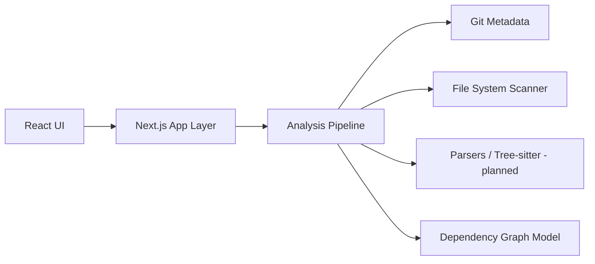

# Cartographer

Cartographer is planned as a local-first repository intelligence and software-project visualization tool that inspects local Git repositories and presents information about structure, language usage, dependencies, Git activity, and module relationships.

This repository currently contains only the initial project foundation. Repository analysis and dashboard behavior have not been implemented yet.

## Goals

- Help developers understand unfamiliar repositories from local source data.
- Demonstrate TypeScript application architecture across UI, server-side analysis, and parsing boundaries.
- Start with practical repository, package/module, file, and import/dependency analysis.
- Avoid promising broad control-flow analysis before the analysis model supports it.

## Planned Features

- Add or select local repositories.
- Repository metadata display.
- File-tree visualization.
- Language statistics.
- Dependency analysis.
- Import and module graph.
- Git history and contributor information.
- Commit activity and file churn.
- Code hotspot discovery.
- TODO/FIXME discovery.
- Test, CI, Docker, deployment-file, and entrypoint discovery.
- Interactive graph visualization.
- Future deeper language-specific static analysis.

## Architecture

The intended architecture separates UI features from local repository analysis. Server-side modules will inspect Git repositories, parse files where appropriate, collect facts, and provide structured data to React views. Initial analysis should move from repository to packages/modules to files to imports and dependencies.

## Repository Structure

- `src/app` - planned Next.js app routes and shell.
- `src/components` - shared UI components.
- `src/features/repositories` - repository selection and metadata feature.
- `src/features/explorer` - file-tree and repository explorer feature.
- `src/features/languages` - language statistics feature.
- `src/features/git` - Git activity and contributor views.
- `src/features/dependencies` - dependency and import analysis views.
- `src/features/graphs` - graph visualization views.
- `src/server/analysis` - planned analysis orchestration.
- `src/server/git` - planned Git integration.
- `src/server/parsers` - planned source parsing boundaries.
- `src/server/repositories` - planned repository registry and access code.
- `docs` - architecture and analysis pipeline notes.

## Technology Stack

- TypeScript - primary language.
- React - planned UI library.
- Next.js - planned application framework.
- Node.js - planned runtime for local repository analysis.
- Tree-sitter - planned source parsing where useful.
- Git CLI or an appropriate Git library - planned repository metadata source.
- Graph visualization library - planned later.
- PostgreSQL - planned only if persistence becomes necessary.

Only minimal package configuration and the source directory skeleton are currently present.

## Development

Setup instructions will be expanded as implementation begins. Dependencies have not been installed and no framework boilerplate has been generated.

## Roadmap

- [ ] Define repository analysis data model.
- [ ] Build local repository selection and metadata extraction.
- [ ] Add file-tree and language statistics analysis.
- [ ] Add import and dependency extraction for initial languages.
- [ ] Add Git history and churn summaries.
- [ ] Add TODO/FIXME, test, CI, and deployment-file discovery.
- [ ] Add graph visualization for module relationships.
- [ ] Decide whether persistence is justified.

## License

MIT. See `LICENSE`.

Cartographer is under active development.
